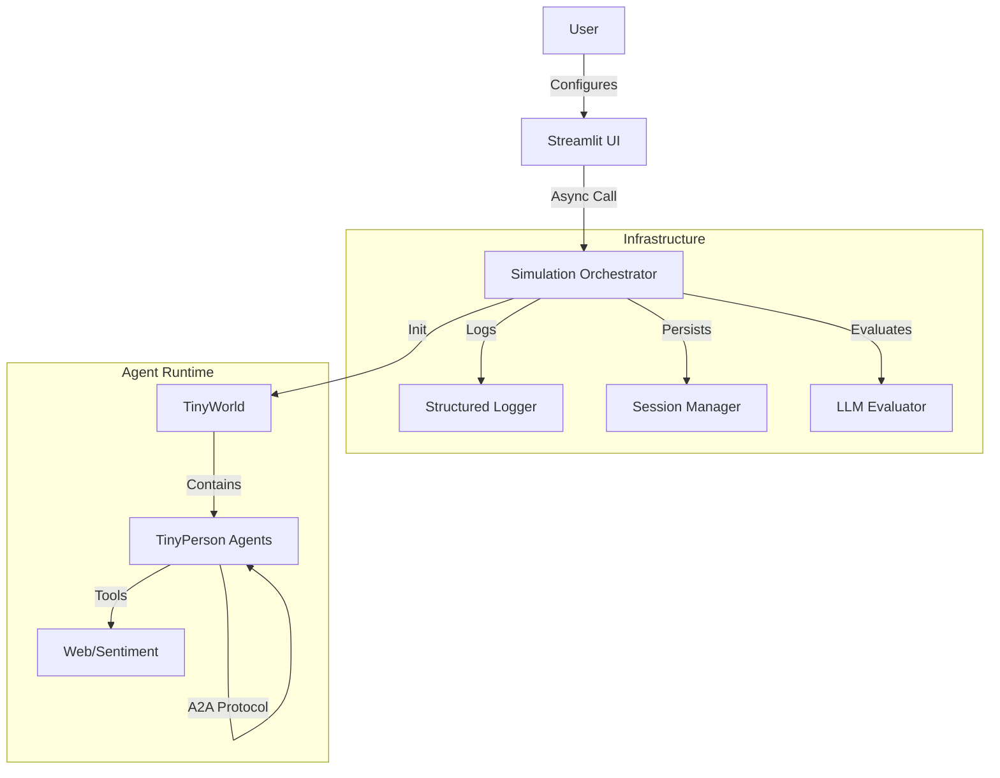
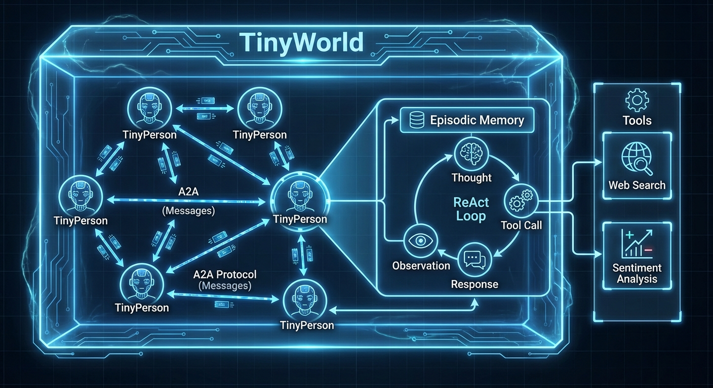
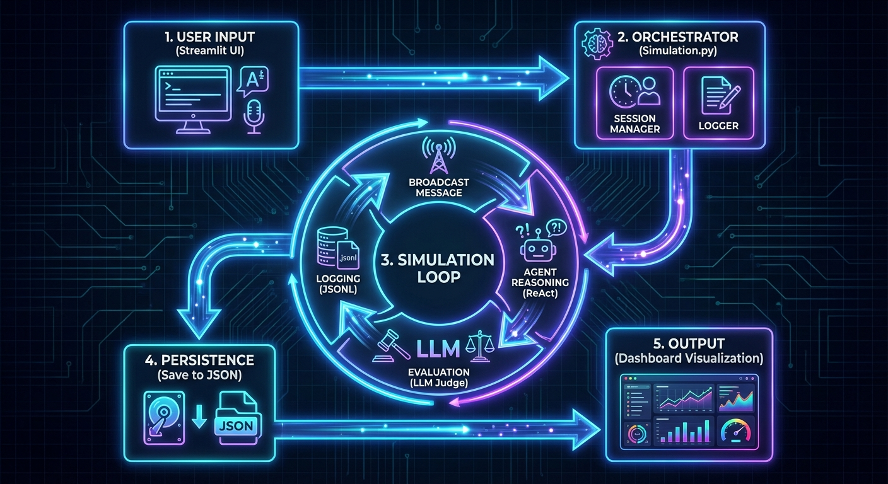
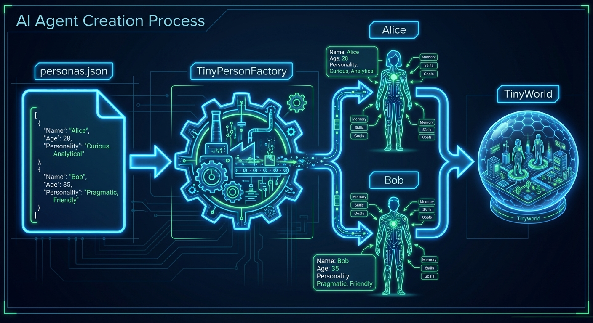

# CrowdSim AI - Architecture & Design

This document details the technical architecture, data flow, and operational lifecycle of the CrowdSim AI platform.

## 1. High-Level Application Architecture

The application follows a **Micro-Service inspired Monolith** pattern, designed for eventual decomposition into distributed services.

### Core Components
1.  **Frontend (UI Layer)**: Built with **Streamlit** (`app.py`). Handles user input, configuration, and visualization.
2.  **Orchestrator (Simulation Layer)**: The `simulation.py` module acts as the controller, managing the lifecycle of the simulation, session state, and observability.
3.  **Agent Runtime (TinyTroupe)**: The core library hosting the AI agents (`TinyPerson`) and the environment (`TinyWorld`).
4.  **Infrastructure Layer**:
    *   **Observability**: `observability.py` (Logs, Metrics).
    *   **Persistence**: `session_manager.py` (JSON storage).
    *   **Evaluation**: `evaluator.py` (LLM-as-a-Judge).
    *   **Protocol**: `TinyTroupe/protocol.py` (A2A Communication).





## 2. Simulation & Agent Architecture

### Agent Design (`TinyPerson`)
Agents are designed as autonomous entities using the **ReAct (Reasoning + Acting)** pattern.
-   **Memory**: `EpisodicMemory` stores conversation history and thoughts.
-   **Tools**: Agents have a registry of tools (e.g., `web_search`) they can invoke.
-   **Communication**: Agents communicate exclusively via the **A2A Protocol** (`Message` objects), decoupling them from the specific runtime implementation.

### Simulation Environment (`TinyWorld`)
The environment acts as the message bus and shared space.
-   **Broadcast**: Delivers messages to all agents.
-   **Turn Management**: Synchronizes agent actions (currently sequential turns).

## 3. Data Flow Journey



### Step 1: Frontend Input
-   **User** enters a "Product Pitch" and "Context" in `app.py`.
-   **Streamlit** packages this into a list of questions and a context string.
-   **Call**: `asyncio.run(run_simulation(...))` is invoked.

### Step 2: Initialization & Session
-   **Orchestrator** checks for a `session_id`.
-   **Session Manager** loads existing agent states from disk (if resuming) or creates new ones from `personas.json`.
-   **Observability** initializes a new Trace ID for this run.

### Step 3: The Simulation Loop
For each question in the input:
1.  **Broadcast**: The question is wrapped in a `Message` (type="system") and sent to all agents.
2.  **Reasoning**: Each agent processes the message.
    *   *Internal Monologue*: "I need to search for X."
    *   *Tool Execution*: Agent calls `web_search`.
    *   *Observation*: Tool returns data.
3.  **Action**: Agent generates a final response `Message` (type="text").
4.  **Logging**: The action is logged to `logs/simulation.jsonl`.
5.  **Evaluation**: The `Evaluator` (LLM-as-a-Judge) asynchronously scores the response for Relevance, Coherence, and Fidelity.

### Step 4: Result Aggregation
-   **Orchestrator** collects all responses, sentiment scores, and quality metrics.
-   **Session Manager** saves the updated agent states to `sessions/<id>.json`.
-   **Return**: A structured dictionary is returned to `app.py`.

### Step 5: Visualization
-   **Streamlit** renders the metrics, charts, and conversation logs on the dashboard.

## 4. Agent Creation Process



1.  **Definition**: Personas are defined in `personas.json` (Name, Age, Occupation, Personality).
2.  **Factory**: The simulation reads this JSON.
3.  **Instantiation**:
    ```python
    agent = TinyPerson(name="Alice")
    agent.define("age", 30)
    agent.add_tool("web_search", ...)
    ```
4.  **Registration**: The agent is added to a `TinyWorld` instance, which manages its accessibility to other agents.
